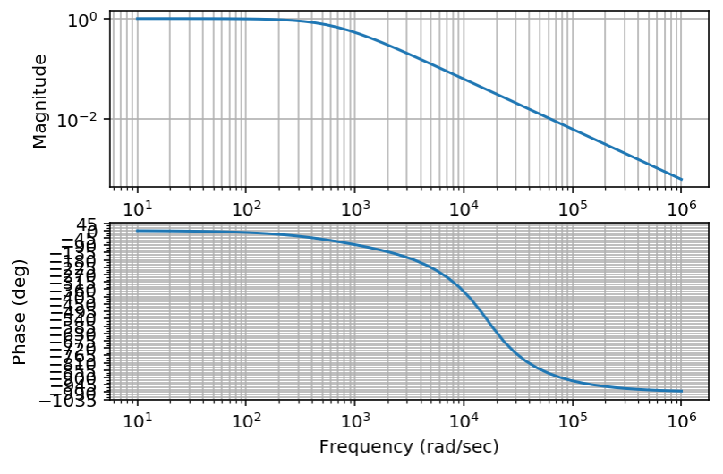
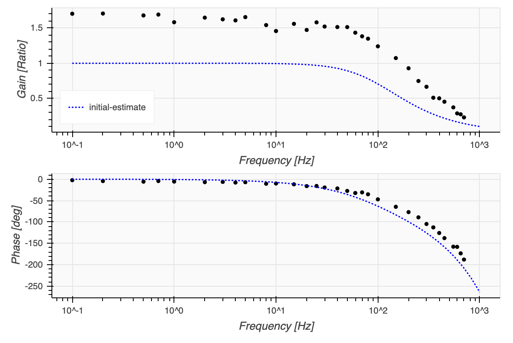
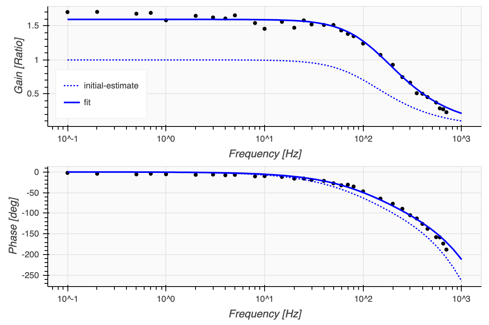

# controls-tools

This is a (currently small) collection of helper functions and utilities to create more visualization and system identification functionality based on the [Python Control Systems Library](https://python-control.readthedocs.io/) package. 

- *bode_overlay.py* overlays transfer function bode plots onto complex domain frequency response measurements.
- *bode_fit.py* contains a class that converts a transfer function into a fit model function and uses lmfit's Model class to determine an optimized parameter set. 

Both of these methods can be used together to present captured data, fit it to a model and update the value assumptions for the parameters.

Similarities to [impedance.py](https://github.com/ECSHackWeek/impedance.py): Originally the fitting technique based on curve-fit was copied exact, but then replaced with lmfit.Model to provide an easier interface to the parameter bounds and initialization. lmfit.Model also contains built-in provisions for fitting complex numbers. 

## Dependencies
- bokeh - everything could be done with matplotlib as well but I'm favoring bokeh at the moment due to its beautiful generation of vector graphics. 
- [lmfit](https://lmfit.github.io/lmfit-py/model.html)
- [python-control](https://github.com/python-control/python-control)
- inspect
- numpy

## An Example

As an example use case, frequency response data was collected for a system behaving as a delayed low-pass filter. The following transfer function is also defined to approximate the behavior. Note the implementation of the delay using the Pade approximation available in python-controls! 
```py
from control import *
%config InlineBackend.figure_format = 'retina'

R = 1000     # ohms
C = 1.6E-6   # farads
t = 0.0005   # seconds
k = 1      # gain, a.u.

p0 = (R,C,t,k)

def my_tf (R,C,t,k):
    num, den = pade(t, n=5)
    return tf(1,[R*C,1])*k*tf(num,den)
```
Python-control contains all the utility to easily plot the transfer function behavior:
```py
bode_plot(my_tf(*p0));
```


But I found it to be a little lacking when I want to compare this tf to my data, or further want to **fit** this tf to my data. **This library** offers the ability to additionally overlay the theoretical response of the transfer function onto  acquired frequency data. 

First import the library:
```py
from controls_tools.bode_fit import *   
from controls_tools.bode_overlay import *
import pandas as pd
```
Then import your data:
```py
old = pd.read_csv('data/open-loop-1.csv')         # open loop data
fol = old['freq_hz']                              # open-loop frequency data
gol = old['mag_response']/old['mag_perturbation'] # open-loop gain data
pol = old['delta_phase']                          # open-loop phase data  
```
And plot:
```py
bode_overlay(fol,gol,pol,
    [my_tf(*p0)],
    ['initial-estimate'],
    colors=['blue'],
    line_dash=['2 2'],
    line_width=[1.5]);
```

This is starting to look really nice, but our parameter value choice doesn't quite matching the data. Lets try to fix that...

Create a complex dataset:
```py
z = convert_magnitude_phase_to_complex(gol,pol)
```
Create a fit model:
```py
fit = bode_fit(my_tf,fol,z)
```
This last command will print the list of parameters if you're using interactive mode: params =  ['R', 'C', 't', 'k']

Now each parameter can be intialized and constrained individually.
```py
fit.params['R'].set(value=1000,   min=500,    max=2000,   vary=False)
fit.params['C'].set(value=1.6E-6, min=1E-6,   max=5E-6,   vary=True)
fit.params['t'].set(value=0.0005, min=0.0002, max=0.001, vary=True)
fit.params['k'].set(value=0.5,    min=0,      max=2,      vary=True)
```
Run the fit and print the values:
```py
fit.fit();
fit.v
```
And plot the results of optimizing the transfer function values:
```py
bode_overlay(fol,gol,pol,
    [my_tf(*p0), my_tf(*fit.v)],
    ['initial-estimate','fit'],
    colors=['blue','blue'],
    line_dash=['2 2','0'],
    line_width=[1.5,2]);
```


Enjoy!

